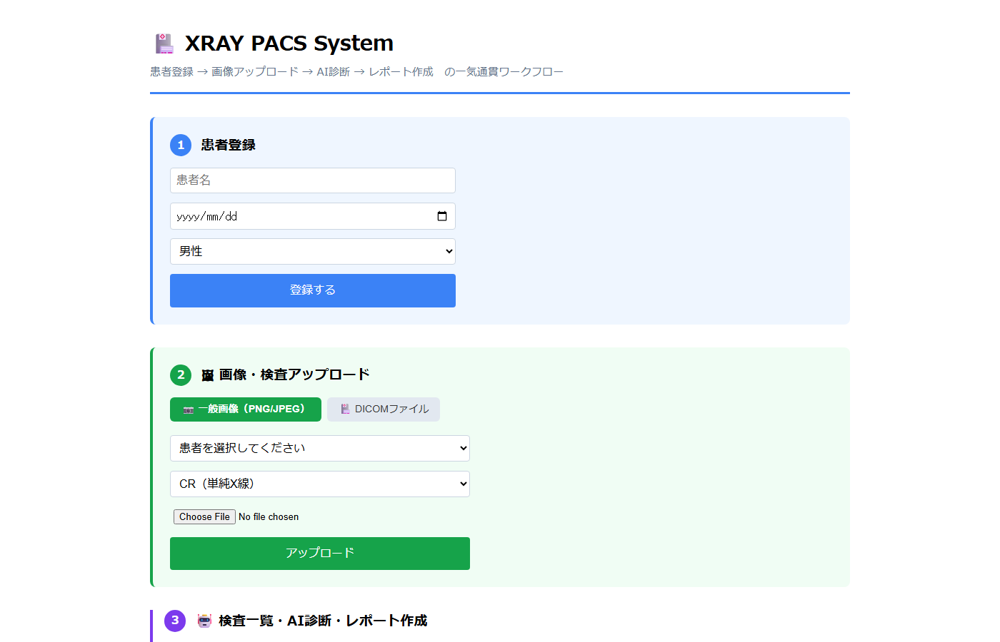
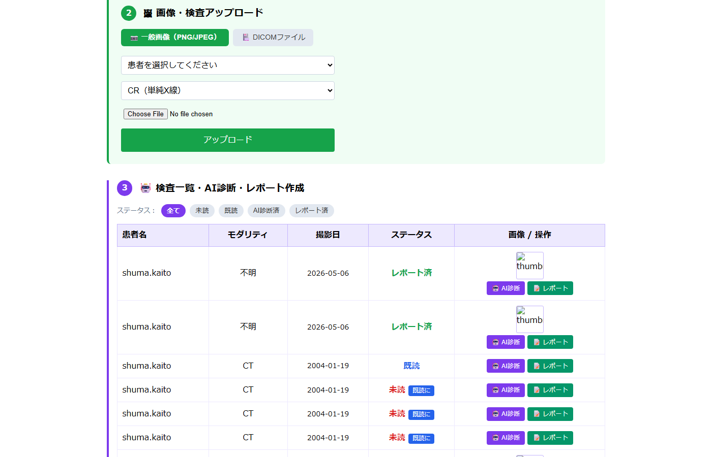

# 🏥 XRAY PACS System

胸部X線のAI診断を統合した、Web ベースの PACS（Picture Archiving and Communication System）です。  
**患者登録 → 画像アップロード → AI診断 → 読影レポート作成** の一気通貫ワークフローを実現しています。

---

## 🖥️ スクリーンショット

### STEP 1 患者登録 / STEP 2 画像アップロード


### STEP 3 検査一覧・AI診断・レポート作成


---

## 📸 機能一覧

| 機能 | 説明 |
|---|---|
| 患者管理 | 患者の登録・一覧・削除 |
| 画像アップロード | PNG/JPEG・DICOMファイルの検査登録 |
| AI診断 | 機械学習モデルによる胸部X線の肺炎/正常判定 |
| 読影レポート | AI所見自動生成 + 医師コメント入力・保存 |
| 画像ビューア | クリックで拡大表示（ライトボックス） |
| ステータス管理 | 未読 / 既読 / AI診断済 / レポート済 |
| 検査タイムライン | 患者ごとのAI診断履歴を時系列で表示 |
| **PHR連携** | 生活習慣ログ（歩数・睡眠・食事・体重）と検査結果を横並び表示 |
---

## 🏗️ システム構成

```
xray-pacs-system/
├── backend/
│   └── app/
│       ├── main.py        # FastAPI：APIエンドポイント定義
│       ├── database.py    # SQLAlchemy：DBモデル定義
│       └── xray_model.pkl # 学習済みMLモデル（Git管理外）
├── frontend/
│   └── src/
│       └── App.jsx        # React：画面全体
├── data/
│   └── images/            # アップロード画像の保存先（Git管理外）
├── sample_images/         # デモ用サンプル画像（Git管理外）
└── create_demo_images.py  # サンプル画像生成スクリプト
```

---

## 🔄 データの流れ

```
【STEP 1】患者登録
  ブラウザ
    │  POST /patients?name=...&birth_date=...
    ▼
  FastAPI (main.py)
    │  Patient オブジェクトを作成
    ▼
  SQLite DB（patients テーブル）

【STEP 2】画像アップロード
  ブラウザ（PNG/JPEG選択）
    │  POST /simple-upload?patient_id=...&modality=CR
    │  body: FormData（画像ファイル）
    ▼
  FastAPI
    │  ① OpenCV で画像をデコード → JPEG として disk に保存
    │     保存先: data/images/{uuid}.jpg
    │  ② Study レコード作成（検査情報）
    │  ③ Image レコード作成（ファイルパス記録）
    ▼
  SQLite DB（studies + images テーブル）

【STEP 3-A】AI診断
  ブラウザ（「AI診断を実行」クリック）
    │  POST /studies/{study_id}/predict-registered
    ▼
  FastAPI
    │  ① DB から Image.file_path を取得
    │  ② OpenCV で disk からグレースケール読み込み
    │  ③ 64×64 にリサイズ → 4096次元ベクトルに変換
    │  ④ xray_model.pkl（scikit-learn）で推論
    │     → 正常(0) / 肺炎(1) + 確信度
    │  ⑤ Image レコードに結果を保存
    │  ⑥ Study.status を「AI診断済」に更新
    ▼
  SQLite DB（images.ai_result, images.ai_confidence 更新）
    │
    ▼
  ブラウザ（診断結果を表示）

【STEP 3-B】AI所見自動生成（テンプレート方式）
  ブラウザ（「✨ AI所見を自動生成」クリック）
    │  POST /generate-report-text?study_id=...
    ▼
  FastAPI
    │  DB から ai_result / ai_confidence / modality を取得
    │  診断結果に応じた所見・結論テキストを生成して返す
    ▼
  ブラウザ（テキストエリアに自動入力）

【STEP 4】レポート保存
  ブラウザ（「レポートを保存する」クリック）
    │  POST /reports?findings=...&conclusion=...&radiologist=...
    ▼
  FastAPI
    │  Report レコードを作成
    │  Study.status を「レポート済」に更新
    ▼
  SQLite DB（reports テーブル）
```

---

## 🗄️ データベース設計

```
patients（患者）
  id, patient_id, name, birth_date, gender, created_at
    │
    │ 1:多
    ▼
studies（検査）
  id, study_id, patient_id, modality, body_part, study_date, status
    │
    │ 1:多
    ▼
images（画像）
  id, study_id, file_path, ai_result, ai_confidence, created_at

reports（レポート）
  id, study_id, patient_name, modality, study_date,
  ai_result, ai_confidence, findings, conclusion, radiologist, created_at
```

---

## 🛠️ 技術スタック

| 層 | 技術 |
|---|---|
| フロントエンド | React 18 + Vite |
| バックエンド | FastAPI（Python） |
| データベース | SQLite + SQLAlchemy |
| 画像処理 | OpenCV, Pillow |
| AI/ML | scikit-learn（Random Forest / SVM） |
| DICOM対応 | pydicom |

---

## ⚙️ セットアップ（WSL / Linux 環境）

### バックエンド

```bash
cd ~/xray-pacs-system/backend
python3 -m venv venv
source venv/bin/activate
pip install fastapi uvicorn sqlalchemy python-dotenv opencv-python \
            scikit-learn pillow pydicom python-multipart joblib numpy

cd app
uvicorn main:app --reload --host 0.0.0.0 --port 8000
```

### フロントエンド

```bash
cd ~/xray-pacs-system/frontend
npm install
npm run dev
# → http://localhost:5173
```

### デモ用サンプル画像の生成

```bash
source ~/xray-pacs-system/backend/venv/bin/activate
python3 ~/xray-pacs-system/create_demo_images.py
# → sample_images/ に PNG 5枚が生成される
```

---

## 📝 AI診断について

- 使用モデル：胸部単純X線（CR）の**肺炎 / 正常 二値分類**モデル
- 入力：グレースケール画像 → 64×64 にリサイズ → 4096次元ベクトル
- 出力：`正常` または `肺炎`、確信度（%）
- ⚠️ CT・MRI・超音波など他のモダリティには対応していません

---

## 🔑 主要 API エンドポイント

| メソッド | パス | 説明 |
|---|---|---|
| POST | /patients | 患者登録 |
| GET | /patients | 患者一覧 |
| DELETE | /patients/{id} | 患者削除（関連データも削除） |
| POST | /simple-upload | 一般画像アップロード（検査自動作成） |
| POST | /dicom/upload | DICOMアップロード |
| GET | /studies | 検査一覧 |
| POST | /studies/{id}/predict-registered | 登録済み画像でAI診断 |
| POST | /reports | レポート作成 |
| GET | /reports | レポート一覧 |
| DELETE | /reports/{id} | レポート削除 |
| POST | /generate-report-text | AI所見テキスト自動生成 |
| GET | /images/{filename} | 画像ファイル配信 |
| GET | /patients/{id}/timeline | 患者の検査タイムライン取得 |
| POST | /patients/{id}/lifelogs | 生活習慣ログ登録 |
| GET | /patients/{id}/lifelogs | 生活習慣ログ一覧 |